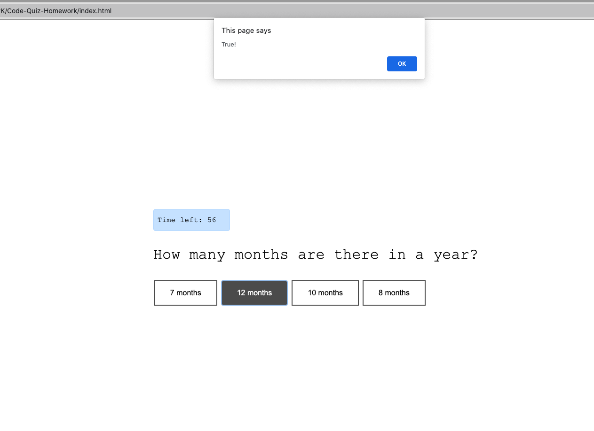

# Document Code Quiz

This project is comprised of HTML, CSS and JavaScript, creating a code quiz that has random timed questions with multiple choice answers. When the user selects an answer, he/she is then presented with an alert that shows whether the answer is true or false. The game comes to an end when all questions have been answered or when the timer reaches zero.

The link to the webpage https://vianneyk.github.io/Code-Quiz/